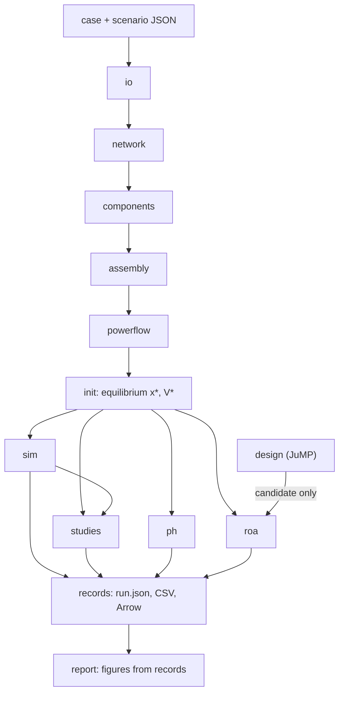

# Porthos.jl

**Port-Hamiltonian Operation and Stability.** A power system simulator and stability toolbox,
written entirely in Julia, where the same model code runs both the simulation and the proofs.

> **Status: pre-alpha (2026-09-29).** Phases P0 to P3 are implemented: case and scenario
> loaders, the parity pack, the Y-bus and the power flow, which match PHPS. Everything from
> P4 on is still design, and the usage examples below show the planned API. The plan is in
> [docs/ROADMAP.md](docs/ROADMAP.md) and the current state in [TODO.md](TODO.md).

---

## What Porthos does

Porthos reads a power system case from JSON: the network, machines, exciters, governors,
converters, loads and events. It builds the case as one differential-algebraic system (DAE)
and then:

- solves the power flow and initialises the system at an equilibrium;
- simulates faults and other events in the time domain;
- runs stability studies: critical clearing time, frequency and voltage indices, and energy
  methods;
- audits the port-Hamiltonian structure of every model: storage, dissipation and passivity;
- **proves** regions of attraction with interval-arithmetic Lyapunov certificates;
- optimises designs. Optimiser output is only a candidate until it has been certified.

Porthos replaces **PHPS**, the Python/C++ simulator in
[Rasoolpey/PHPS_Opt](https://github.com/Rasoolpey/PHPS_Opt). PHPS is frozen and used only as
the parity reference: each stage of Porthos is checked against numbers PHPS produced.

### About the name

*Porthos* stands for **PORT**-**H**amiltonian **O**peration and **S**tability. Like the
musketeer, it works on a *one for all* principle: each component model is written once and
runs with every number type Porthos needs. That means floating point for simulation, dual
numbers for Jacobians, intervals for proofs and symbols for documentation.

---

## Why a rewrite

In PHPS, each model exists in three versions: a C++ simulation kernel, a SymPy expression for
the symbolic DAE, and generated Julia code for the interval proofs. Each version needs parity
checks against the others. Also, most of the run time goes to Python overhead rather than to
the arithmetic itself. Current IEEE-39 timings:

| Stage | PHPS today |
|---|---|
| SymPy DAE build from the C++ kernels | about 28 s per run |
| Equilibrium Krawczyk certificate (Python) | about 26 s |
| First-order Jacobian hull | 15.5 s in Python, 0.4 s in Julia |
| Centered hull | about 6 s (Julia) |
| Structured SDP (cvxpy/SCS, 171 + 342 PSD blocks) | did not finish in 25 min |

Porthos fixes both problems. There is one model code (principle 1), and Julia does all the
computing (principle 5). The `bench/` suite tracks these numbers.

---

## Design principles

### 1. One model code for simulation and proof

Each component is a set of plain Julia functions that are generic in the number type, so the
same `rhs!` runs with every type below:

| Number type | Used for |
|---|---|
| `Float64` | power flow, simulation |
| `ForwardDiff.Dual`, sparse automatic differentiation | Jacobians, Newton, linearisation |
| intervals, first- and second-order interval jets | ROA certificates, containment audit |
| Symbolics.jl | documentation, structural checks |

This removes the three-way split between C++ kernel, SymPy and generated Julia, and with it
every parity layer between them.

Rules for component code:

- do not fix numeric arguments to concrete types such as `Float64`;
- do not use a bare `if` on a state-dependent value (see principle 2);
- `rhs!` must not allocate.

### 2. Limiters and branches are explicit

Every limiter, clamp, anti-windup or non-windup test, and guard is written with a small set
of primitives instead of `if`: `clamp_mode`, `nonwindup`, `select(cond, a, b)` and
`guard_min`. Each primitive:

- on `Float64`, evaluates normally;
- on intervals, returns the branch it decided and the margin, or raises *undecided*. The
  containment audit relies on this;
- reports its switching surface, so the simulator can find the switching instant.

### 3. Proofs, not samples

- **Certificates are proofs.** Region-of-attraction (ROA) and stability certificates come from
  Lyapunov and energy functions with interval or validated enclosures. Simulation-based
  boundaries and CCT sweeps never count as ROA evidence.
- **Certificate discipline:**
  - intervals are rounded outward;
  - every gate uses the same box;
  - each certificate records fingerprints of the case, the model and the candidate;
  - `verified_valid_level` is written only when every gate passes.
- **Candidates are not proofs.** Output from optimisation (JuMP) is only a candidate.
  Sampling the vector field at points (falsification) can find counterexamples but never
  raises a verified level.
- **Independent second check.** `ROACheck` checks every certificate again on its own terms. It
  recomputes the digests and tests definiteness with a different method (interval `LDLᵀ`).

### 4. Parity before new physics

Porthos is built in phases, P0 to P12 (see [Roadmap](#roadmap)). Each phase ends with a
**parity gate**, a test against the **parity pack**: a read-only set of reference numbers
generated once from PHPS. A phase is done only when its gate passes in CI. New modelling
(Part II) starts only after full parity.

### 5. Julia computes, Python only drives

Python is allowed to do two things only:

1. create or edit JSON files (case variants, scenario sweeps);
2. call a Porthos entry point, which returns the path of the record it wrote.

Python does no computing at run time: no NumPy computation, no plotting and no validation. A
lint test in `test/lint/` rejects NumPy, SciPy or matplotlib imports under `python/`, except in
the JSON-editing helpers.

### 6. Every number can be traced

Every run and every study writes a `run.json` that records:

- hashes of the case, the scenario, the source (git commit plus a dirty flag) and the
  Manifest;
- the solver settings;
- the wall time.

Any number in a paper can therefore be traced back to the code and inputs that produced it.

---

## Architecture



| Module | What it does |
|---|---|
| `io` | JSON schema validation; loaders for cases, scenarios and contracts; a safe parameter-expression reader (`"2.0 * M_PI * 60.0"`, never `eval`); results writers; run metadata and hashes |
| `network` | buses, lines, transformers (tap, phase shift), shunts, Y-bus, fault and topology events |
| `components` | the component interface, the limiter primitives, and one file per model type |
| `assembly` | wiring graph from `connections`; port resolution; state layout and names in PHPS order; COI reference angle; one-way reservoir coordinates; DAE residual and its sparsity pattern |
| `powerflow` | Newton-Raphson AC power flow with PV/PQ/slack handling and Q-limit options |
| `init` | power flow, then each component's `initialize`, then one Newton solve of the full DAE for `(x*, V*)` |
| `sim` | IDA (Sundials.jl), fixed-step BDF1 and OrdinaryDiffEq mass-matrix methods; event callbacks; algebraic states re-initialised after each switch |
| `studies` | CCT; frequency indices (RoCoF, nadir); voltage studies (Q-V, snap, LVRT recovery); energy margin and reservoir work; sweeps |
| `ph` | Hamiltonians; port-Hamiltonian structure checks; the shifted-storage audit; KYP and passivity tests |
| `roa` | interval core and sparse jets; candidate `V_P`; equilibrium Krawczyk; KCL branch; first-order and centered hulls; definiteness and mean-value gates; containment audit; certificate records; `ROACheck` |
| `design` | JuMP programs: conditioning, hull-aware LMI, PH-informed storage, OPF-type problems |
| `report` | scenario `plots` blocks, figures (CairoMakie), per-run summaries |

### Component interface

Every model is a subtype of `AbstractComponent` and implements:

| Function | Meaning |
|---|---|
| `states(c)`, `params(c)`, `ports(c)` | declared state names, parameters, and input/output ports |
| `rhs!(dx, c, x, u, p)` | differential equations, generic in the element type |
| `outputs!(y, c, x, u, p)` | port outputs, for example `Efd`, `Tm` and currents |
| `injection(c, x, V, p)` | Norton or current injection into KCL, and whether it adds admittance |
| `initialize(c, targets)` | states from the power-flow targets |
| `hamiltonian(c, x)`, `grad_hamiltonian(c, x)` | declared storage and its gradient |
| `observables(c)` | derived signals written to results, such as `delta_deg` and `H_steam` |
| `contract(c)` | the port-contract entry, including `domain_clauses` |
| `modes(c, x, u)` | the limiter and branch decisions (principle 2) |

### Models

| Family | Types | Phase |
|---|---|---|
| Network | `PiLine`, `Transformer2W`, shunts | P2 |
| Machines | `GENROU_PHTRUE`, `GENSAL_PHTRUE` | P4.1 |
| Exciter | `IEEET1_PHTRUE` | P4.2 |
| Governors | `IEEEG1_PHTRUE`, `IEEEG3_PHTRUE` | P4.2 |
| Load | `COMPLEXLOAD` (contract key `ComplexLoad`) | P4.3 |
| Grid-following converters | `GFL_PHTRUE`, `GFL_ZIF_PHTRUE` | P4.4 |
| Grid-forming converters | `GFM_VSM_PHTRUE`, `GFM_DROOP_PHTRUE`, `GFM_VOC_PHTRUE` | P4.5 |
| Later, only if needed | `GENROU_PHS`, `IEEEX1_PHS`, `TGOV1_PHS`, `IEEEST_PHS` | after P12 |

Events: `BusFault` and `LineFault`, with line trip and load step to follow. Solver methods:
`ida`, `bdf1` and `rk4`.

### Inputs and outputs

**Inputs.** Porthos reads the PHPS JSON formats unchanged, so every existing case runs without
conversion:

- system files: `config`, `Bus`, `PQ`, `PV`, `Slack`, `Line`, `Shunt`, `components`,
  `connections`;
- scenario files: `system`, `solver`, `events`, `output`, `plots`.

Both formats have a JSON Schema in `cases/schema/`, and the loader validates against it.

**Outputs.** Each run writes:

- `simulation_results.csv`, with the same column names as PHPS, so existing study scripts and
  PowerFactory comparisons still work;
- a binary copy of the results (Arrow or JLD2);
- `run.json` (principle 6).

---

## Repository layout

```
Porthos.jl/
├── README.md
├── TODO.md                 current state, open decisions, next steps (updated each session)
├── LICENSE
├── Project.toml            name, uuid, [deps], [weakdeps], [extensions], [compat]
├── Manifest.toml           committed: the exact environment that every record hashes
├── Artifacts.toml          content hashes of the parity pack and the PowerFactory references
├── src/
│   ├── Porthos.jl          module, public API, includes
│   ├── io/                 schemas, loaders, expression reader, parameter processing,
│   │                       parity-pack reader; later writers and run metadata
│   ├── network/            Y-bus, transformers, shunts, fault and topology events
│   ├── components/
│   │   ├── interface.jl    AbstractComponent and the interface functions
│   │   ├── primitives.jl   clamp_mode, nonwindup, select, guard_min
│   │   ├── machines/       genrou.jl, gensal.jl
│   │   ├── exciters/       ieeet1.jl
│   │   ├── governors/      ieeeg1.jl, ieeeg3.jl
│   │   ├── loads/          complexload.jl
│   │   └── converters/     gfl.jl, gfl_zif.jl, gfm_vsm.jl, gfm_droop.jl, gfm_voc.jl
│   ├── assembly/
│   ├── powerflow/
│   ├── init/
│   ├── sim/
│   ├── studies/
│   ├── ph/
│   ├── roa/
│   └── precompile.jl       PrecompileTools workloads
├── ext/                    loaded only when the heavy dependency is loaded
│   ├── PorthosMakieExt/    report: figures (CairoMakie)
│   └── PorthosJuMPExt/     design, KYP and LMI programs (JuMP + solvers)
├── cases/                  case and scenario JSON, same format as PHPS (README: PHPS commit)
│   └── schema/             system.schema.json, scenario.schema.json
├── contracts/              model_port_contracts.json (schema 2.1-reservoir-corrected)
├── parity/
│   ├── generate/           generate_pack.py + pinned requirements.txt: run against a PHPS
│   │                       checkout to build the pack
│   └── README.md           pack contents, PHPS commit, hashes, baselines
├── test/
│   ├── runtests.jl
│   ├── unit/               components, primitives, solvers, interval decisions
│   ├── parity/             one file per P-gate
│   └── lint/               the Python import rule
├── bench/                  timing suite for the numbers in "Why a rewrite"
├── scripts/                setup.ps1 (one-command install), bind_parity_pack.jl; later the
│                           command-line entry points simulate.jl, cct.jl, certify.jl
├── python/                 thin juliacall wrapper: pyproject.toml, porthos/__init__.py
├── docs/
│   ├── ROADMAP.md
│   └── src/                Documenter.jl pages: models, equations, proofs
├── outputs/                run records (git-ignored)
└── .github/workflows/      CI: unit and parity tests
```

Why some of it is laid out this way:

- **`ext/` holds the heavy dependencies.** CairoMakie, JuMP and the SDP solvers are Julia
  package extensions. `using Porthos` loads only what a simulation or a certificate needs,
  which keeps start-up fast. `src/` declares the plotting and design functions, and the
  extensions implement them.
- **Large data is stored as artifacts, not in git history.** The parity pack and the
  PowerFactory references (about 81 MB) are content-hashed tarballs bound in `Artifacts.toml`.
  The hash makes them read-only by construction: a new baseline is a new artifact with a new
  hash and a written reason.
- **`parity/generate/` is the only place where PHPS code runs.** It is exempt from the Python
  lint, because its job is to produce the reference numbers. It records the PHPS commit it ran
  against.
- **Inputs arrive when they're needed.** Case JSON and contracts are copied from PHPS as the
  phases need them, starting at P1, unchanged and with the PHPS commit recorded. They're
  small, so they go into git.

---

## Setup

On Windows, one command installs everything: juliaup and Julia 1.12 (pinned for this
directory), the Julia packages from the committed Manifest, the parity pack, and the Python
environment used only to regenerate the parity pack from PHPS:

```
powershell -ExecutionPolicy Bypass -File scripts\setup.ps1            # add -RunTests to run the suite
```

It can be re-run safely. `-SkipPython` leaves out the parity-pack generator's Python
environment (pinned in [parity/generate/requirements.txt](parity/generate/requirements.txt)).
On other systems: install Julia 1.12 (juliaup), then
`julia --project -e "using Pkg; Pkg.instantiate()"`.

## What works now (P0 to P3)

```julia
using Porthos

case = load_case("cases/IEEE39Bus_PF/system_phtrue.json")      # schema-validated
sc   = load_scenario("cases/IEEE39Bus_PF/bus_fault_bus16_150ms.json")

Y  = ybus_dae(case)                   # DAE network matrix (loads, Norton stamps), sparse
Yf = with_fault(Y, fault_shunts(Network(case), sc.events))     # fault-on network
pf = solve_powerflow(case)            # Newton-Raphson, same iterates as PHPS
pf.V, pf.theta

pack = load_parity_pack()             # PHPS reference numbers, every file hash-checked
```

Tests: `julia --project test/runtests.jl`, or `scripts\setup.ps1 -RunTests`. The Y-bus
matches PHPS bit for bit and the power flow to about `4e-15` on all six parity cases.

## Planned usage

> Target API: not implemented yet.

**Julia**

```julia
using Porthos

rec = simulate("cases/IEEE39Bus_PF/bus_fault_bus16_150ms.json")
# "outputs/IEEE39Bus_PF/bus_fault_bus16_150ms/run.json"

cct("cases/IEEE39Bus_PF/cct_series_bus16.json")
certify_roa("cases/IEEE39Bus_PF/no_fault_phtrue.json")

using CairoMakie        # loads the plotting extension
plot_record(rec)
```

**Command line**

```
julia --project scripts/simulate.jl cases/IEEE39Bus_PF/bus_fault_bus16_150ms.json
```

**Python** (to drive runs only)

```python
from porthos import simulate
record = simulate("cases/IEEE39Bus_PF/bus_fault_bus16_150ms.json")  # path to run.json
```

Start-up delay is handled in three ways:

- PrecompileTools workloads cover loading, simulation and certificates;
- an optional PackageCompiler system image removes the per-run compile delay;
- a persistent session serves sweeps and interactive work.

---

## Roadmap

The full plan is in [docs/ROADMAP.md](docs/ROADMAP.md).

### Part I: reach parity with PHPS

| Phase | What is built | Gate | Status |
|---|---|---|---|
| P0 | environment, pinned dependencies, parity pack import | CI runs; every parity file loads | done locally; CI waits for the pack release upload |
| P1 | loaders, schemas, contract loader, expression reader | every JSON under `cases/` loads and round-trips | done |
| P2 | Y-bus, bus map, fault admittances | Y-bus equal to PHPS within `1e-12` | done (bit-identical) |
| P3 | Newton-Raphson power flow | voltages match PHPS and the case `v0`/`a0` within `1e-8` | PHPS part done (`4e-15`); `v0`/`a0` clause under review, see [TODO.md](TODO.md) |
| P4 | components, active set first | `rhs`, outputs, injection, `H` and `∇H` match at 200 random states with both limiter branches exercised; contract identical | next |
| P5 | assembly, DAE residual, sparsity | `f` and `g` match at 50 random states per case | |
| P6 | initialisation | `x*` and `V*` match PHPS; DAE residual at most `1e-12` | |
| P7 | simulation, events, results writer | bus-16 fault: BDF1 against BDF1, IDA against IDA, and the PowerFactory metrics | |
| P8 | reports | figures regenerate from records alone | |
| P9 | studies | recorded anchors reproduced: CCT, energy walls, frequency indices, Q-V margin `6.055 → 12.383 pu`, `D_r` | |
| P10 | port-Hamiltonian audits | rank `54/171`, 41 positive eigenvalues, max `+12.882693`; IEEEG1 crossing at `1.934718 rad/s`; KYP infeasible on all nine sets | |
| P11 | ROA certificate pipeline | `verified_valid_level = 2.69e-12` for both candidate `P`; centered decay at `5.16e-10`; all 83 contract clauses pass | |
| P12 | Python wrappers; old pipeline retired | a fresh clone reproduces the parity suite with one command | |

### Part II: the modelling and stability programme (after parity)

- **II.1 Larger certified ROA (Target A).**
  - Containment at the centered level.
  - A structured hull-aware LMI for `P`, using sparsity instead of dense cones.
  - Fault reach without simulation, proving `dV_P/dt ≤ a V_P + b` on the fault-on field. This
    gives a **certified CCT lower bound**.
  - Falsification evidence.
- **II.2 Making the Hamiltonian `H` itself a Lyapunov function (Target B).**
  - Add the network potential `U_net` to the storage.
  - A PH-informed storage LMI to find the cross-terms that are needed.
  - Nonlinear storage terms, each with a stated physical origin.
  - Decay repair: passivity indices, KYP/IQC supply rates, new ports, physical extensions.
  - Closure of the network port.
  - Storage for converter controllers.
  - Certification of the non-quadratic `H_ext`.
- **II.3 Physical converter models.** The dc link, LCL filter and inner current loop as real
  port-Hamiltonian storage, replacing the reservoir account.

---

## Testing and validation

| Level | What it checks |
|---|---|
| Unit | each component, each primitive (limiter decisions on intervals), each solver |
| Parity | every P-gate, in CI, against the read-only parity pack |
| External | PowerFactory references, with the metrics and thresholds PHPS uses today |
| Certificates | the analytic 1-D and 2-D test systems, plus the IEEE-39 records |
| Performance | `@code_warntype` and allocation tests on every `rhs!`; `bench/` timings |

### Contribution rules

- A new component comes with:
  - its interface functions;
  - its contract entry;
  - a parity or reference test at random states, with both sides of every limiter exercised;
  - an allocation test on `rhs!`.
- No bare `if` on state-dependent values in component code.
- No numerics in `python/`.
- The parity pack is never edited in place.

---

## Glossary

| Term | Meaning |
|---|---|
| PH | port-Hamiltonian: `ẋ = (J − R) ∇H + g u`, where `H` is the storage, `J` the skew-symmetric interconnection and `R ⪰ 0` the dissipation |
| Reservoir | one-way accounting state that records the energy a source delivers (constant-power law `dx_r = (P_ref − P_draw)/p_r`). It is neutral and is left out of the ROA coordinates |
| Physical quotient | the 171 physical coordinates of IEEE-39 that remain after removing reservoirs, held states and the common rotor angle |
| `V_P`, `Ω_c` | quadratic Lyapunov candidate on the physical quotient, and its sublevel set `{V_P ≤ c}` |
| `verified_valid_level` | the largest `c` at which every certificate gate passed |
| Jacobian hull | interval enclosure of the Jacobian over a box. *First-order* and *centered* are two ways to build it; centered is tighter |
| Krawczyk test | interval Newton test that proves a unique equilibrium exists in a box |
| Containment audit | proof that every limiter decision and every contract `domain_clause` holds on the certified box; it fails closed |
| Parity pack | read-only reference numbers generated once from PHPS |
| COI, CCT | centre of inertia; critical clearing time |

---

## Relation to PHPS

PHPS ([Rasoolpey/PHPS_Opt](https://github.com/Rasoolpey/PHPS_Opt)) stays as it is. It is used
for:

- generating the parity pack, once, from a recorded commit;
- supplying the model equations, proofs and study history, which are documented there in
  `phps/PHPS_nonlinear_PH_Lyapunov_ROA_roadmap.md` and `phps/HOW_TO_ADD_PH_COMPONENT.md`.

PowerFactory remains the external reference for model validation. PHPS is the internal
reference for parity.

## License

MIT, as for PHPS. See [LICENSE](LICENSE).
